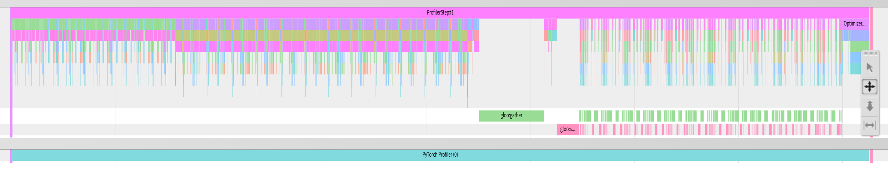
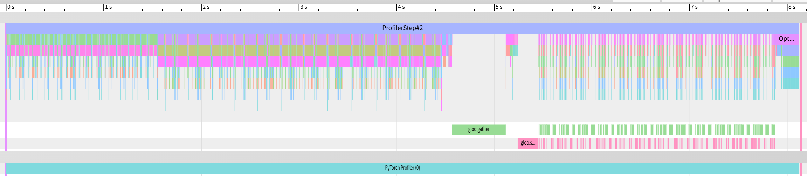
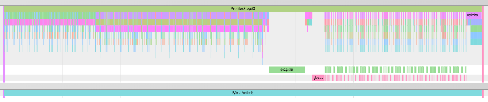
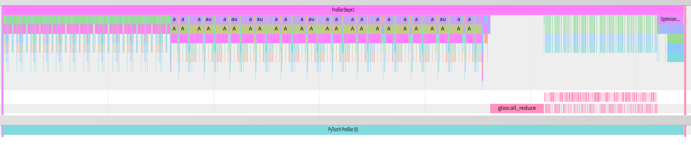
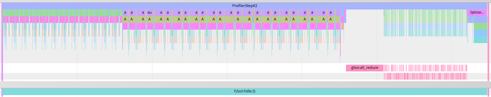
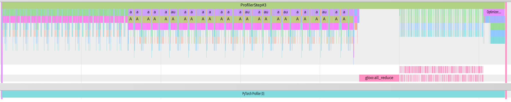
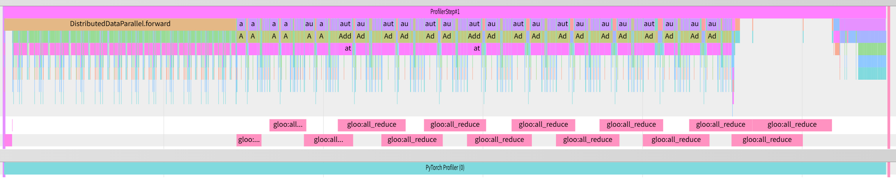
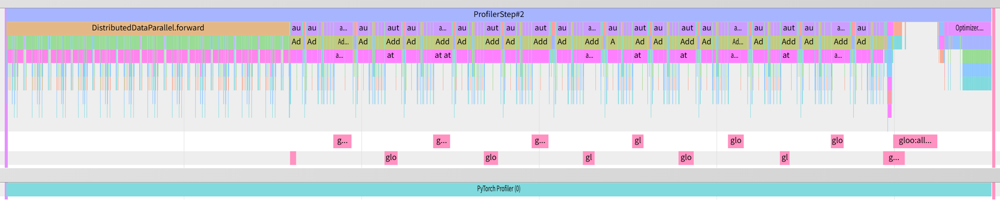
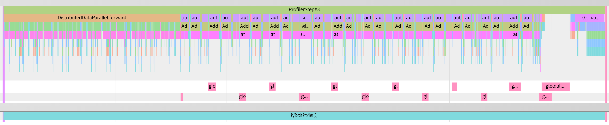

# COS568 HW 2

## Task 1: Single-Node Fine-Tuning

Fine-tuned BERT-base-cased on the RTE for 3 epochs with batch size 64, lr 2e-5, max seq len 128.

| Epoch | Accuracy |
|-------|----------|
| 1     | 62.82%   |
| 2     | 64.98%   |
| 3     | 62.09%   |

Average loss over 3 epochs: 0.6365 (117 global steps).

The accuracy fluctuates across epochs, which is expected given RTE's small dataset size. Tuning on small ones are inherently noisy.

## Task 2 & 3: Distributed Training (1 Epoch, 4 Nodes)

Batch size: 16 per worker x 4 workers = 64 total (matching before). Backend: `gloo` over TCP. Each node runs one process with a distinct `local_rank`.

### Average Time per Iteration (excluding first iteration)

| Task | Method | Avg Time/Iter (s) |
|------|--------|--------------------|
| 2a   | gather/scatter | 8.01 |
| 2b   | all_reduce     | 6.43 |
| 3    | DDP            | 5.23 |

Times are consistent across all 4 ranks (within 0.001s), confirming synchronous training.

### Evaluation Results

| Task | Method | Accuracy | Avg Loss |
|------|--------|----------|----------|
| 2a   | gather/scatter | 58.84% | 0.6985 |
| 2b   | all_reduce     | 58.84% | 0.6985 |
| 3    | DDP            | 59.57% | 0.6937 |

### Loss Curves

Tasks 2a and 2b produce exactly the same loss values on every rank at every step, as expected -- both methods compute the same averaged gradients via different communication primitives.

**Task 2a / 2b loss per node (first 10 steps):**

| Step | Rank 0 | Rank 1 | Rank 2 | Rank 3 |
|------|--------|--------|--------|--------|
| 0  | 0.9413 | 0.8975 | 0.9055 | 0.6244 |
| 1  | 0.9275 | 0.8089 | 0.6893 | 0.6379 |
| 2  | 0.6337 | 0.7752 | 0.6746 | 0.7848 |
| 3  | 0.5746 | 0.6154 | 0.5808 | 0.8474 |
| 4  | 0.7926 | 0.7325 | 0.6409 | 0.7629 |
| 5  | 0.7362 | 0.6826 | 0.8026 | 0.7862 |
| 6  | 0.7481 | 0.7972 | 0.6470 | 0.6439 |
| 7  | 0.7045 | 0.8497 | 0.7226 | 0.7529 |
| 8  | 0.7056 | 0.7141 | 0.7656 | 0.6252 |
| 9  | 0.6486 | 0.7543 | 0.6503 | 0.6525 |

Each rank sees different data (via `DistributedSampler`) so local losses differs, but all share the same model weights after each grad sync.

**Task 3 (DDP) loss per node (first 10 steps):**

| Step | Rank 0 | Rank 1 | Rank 2 | Rank 3 |
|------|--------|--------|--------|--------|
| 0  | 0.9413 | 0.8975 | 0.9055 | 0.6244 |
| 1  | 0.8929 | 0.7918 | 0.6797 | 0.6271 |
| 2  | 0.6499 | 0.7262 | 0.7077 | 0.7331 |
| 3  | 0.6083 | 0.6006 | 0.6400 | 0.7530 |
| 4  | 0.7482 | 0.6716 | 0.7028 | 0.7702 |
| 5  | 0.7163 | 0.6497 | 0.7736 | 0.7853 |
| 6  | 0.7122 | 0.6817 | 0.6513 | 0.6774 |
| 7  | 0.7204 | 0.7670 | 0.7510 | 0.7240 |
| 8  | 0.6837 | 0.7427 | 0.6548 | 0.6956 |
| 9  | 0.7026 | 0.6736 | 0.7076 | 0.7058 |

Step 0 losses match across all methods. DDP diverges from step 1 onward because DDP averages gradients during the backward pass, whereas Tasks 2a/2b clip gradients first, then average.

## Task 4: Profiling and Communication Overhead

Profiled using `torch.profiler.profile` with `torch.profiler.schedule(wait=0, warmup=0, active=1, repeat=0)`. Each step is profiled individually and exported via `tensorboard_trace_handler`. Step 0 is discarded; steps 1-3 are analyzed.

### Profiling Traces

**Task 2a -- gather/scatter (steps 1-3):**

The traces show `gloo:gather` and `gloo:scatter` operations occurring sequentially after the backward pass, one per parameter.

**Task 2b -- all_reduce (steps 1-3):**

The traces show `gloo:all_reduce` operations after the backward pass. Fewer total communication calls than gather/scatter since each parameter requires only one collective instead of two.

**Task 3 -- DDP (steps 1-3):**

The traces show `gloo:all_reduce` calls overlapping with the backward computation under the `DistributedDataParallel.forward` span. DDP buckets gradients and initiates communication during the backward pass rather than waiting until it completes.

### Communication Overhead (Rank 0)

**Task 2a -- gather/scatter:**

| Step | Total Time (ms) | Comm Time (ms) | Comm Overhead |
|------|-----------------|----------------|---------------|
| 1    | 33024           | 2791           | 8.5%          |
| 2    | 32689           | 2650           | 8.1%          |
| 3    | 32904           | 2712           | 8.2%          |

**Task 2b -- all_reduce:**

| Step | Total Time (ms) | Comm Time (ms) | Comm Overhead |
|------|-----------------|----------------|---------------|
| 1    | 27052           | 1528           | 5.6%          |
| 2    | 27037           | 1560           | 5.8%          |
| 3    | 26452           | 1505           | 5.7%          |

**Task 3 -- DDP:**

| Step | Total Time (ms) | Comm Time (ms) | Comm Overhead |
|------|-----------------|----------------|---------------|
| 1    | 30628           | 5312           | 17.3%         |
| 2    | 27976           | 1298           | 4.6%          |
| 3    | 26905           | 1142           | 4.2%          |

DDP's step 1 shows higher communication overhead due to initial bucket construction and parameter broadcast. Steps 2-3 show DDP's steady-state overhead at 4.2-4.6%, which is lower than all_reduce's 5.7%.

### Comparison: all_reduce vs DDP

DDP achieves ~4.4% communication overhead vs all_reduce's ~5.7%, making DDP 23% more efficient in communication overhead percentage.

DDP is more efficient because:

1. Gradient bucketing: DDP groups small parameters gradients into larger buckets before the communication, this reduces the number of all_reduce calls. Instead of ~200 individual all_reduce operations of one per parameter, DDP gets a handful of bucketed all_reduce calls, amortizing communication latency.

2. Overlapping communication with computation: DDP initiate all_reduce for a bucket as soon as all gradients in that bucket are computed during the the backward pass, overlapping communication with the backward computation of earlier layers. In contrast, the 2b) implementation waits until all gradients are computed before starting any all_reduce calls.

3. Efficient implementation: DDP uses optimized C++ hooks registered on the autograd engine, avoiding Python-level iteration over parameters.

These optimizations are discussed in detail in the PyTorch Distributed paper.

### Comparison: gather/scatter vs all_reduce

Gather/scatter (8.2% overhead, 8.01s/step) is slower than all_reduce (5.7% overhead, 6.43s/step) because:

- Gather/scatter requires two collective operations per parameter (gather to rank 0, then scatter back), while all_reduce requires only one.
- Gather/scatter funnels all communication through rank 0, creates a bottleneck. All_reduce distributes the work across all nodes.

## Scalability

Our results show clear performance ordering: DDP > all_reduce > gather/scatter. The wall-clock speedups are:

- all_reduce is 1.25x faster than gather/scatter (6.43s vs 8.01s)
- DDP is 1.53x faster than gather/scatter (5.23s vs 8.01s)
- DDP is 1.23x faster than all_reduce (5.23s vs 6.43s)

However, with 4 workers the total training time per epoch is still longer than single-node Task 1 (~2.9s/step for 39 steps vs ~5.23s/step for 39 steps with DDP). This is due to the communication overhead outweighs the computational savings from smaller per-worker batch sizes on this small dataset. Distributed training becomes more beneficial when:

- The model is larger (more computation per step to overlap with communication)
- The dataset is larger (more steps per epoch, amortizing setup costs)
- GPU accelerators are used (faster computation makes the compute-communication ratio more favorable)

For BERT-base on RTE (a small dataset), single-node training is more efficient. The value of distributed training becomes apparent with larger models and datasets where the computation-to-communication ratio is higher.

## Implementation Details

- Platform: Using the ionic cluster with Slurm, request 4 CPU nodes, with 1 task each, `gloo` backend over TCP
- Process group init: `tcp://{master_ip}:{master_port}` with `SLURM_PROCID` as rank
- Data partitioning: `torch.utils.data.distributed.DistributedSampler` for non-overlapping data splits
- Task 2a: Per-parameter `torch.distributed.gather` to rank 0, averaging, then `torch.distributed.scatter` back
- Task 2b: Per-parameter `torch.distributed.all_reduce(SUM)` followed by division by world_size
- Task 3: Model wrapped with `torch.nn.parallel.DistributedDataParallel` after `model.to(device)`; gradient sync is automatic during backward
- Task 4: `torch.profiler.profile` with `schedule(wait=0, warmup=0, active=1, repeat=0)` and `tensorboard_trace_handler` for incremental trace export. Step 0 discarded in analysis.

